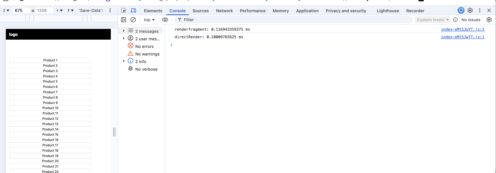

# JavaScript DOM - The "High-Performance" List

## Task
- UI: Create a simple <ul> with the ID product-list.
- Create a JS array with 50 product names.
- Write a function to generate <li> items for each product.
- use DocumentFragment to append them

